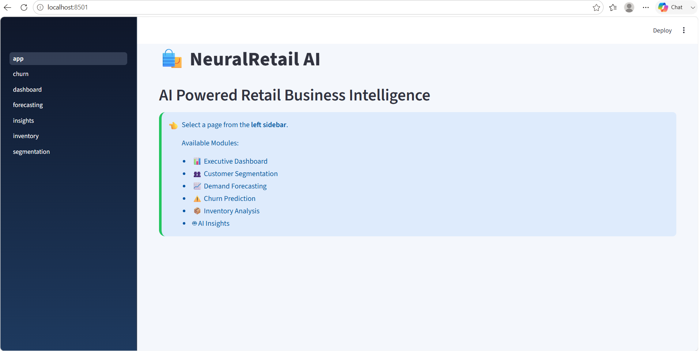
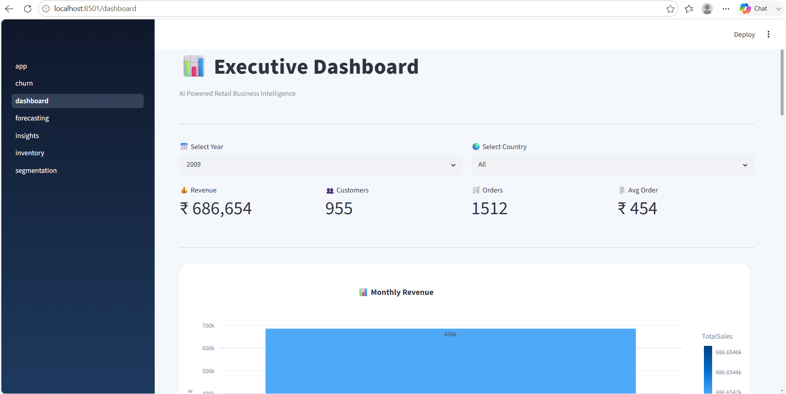
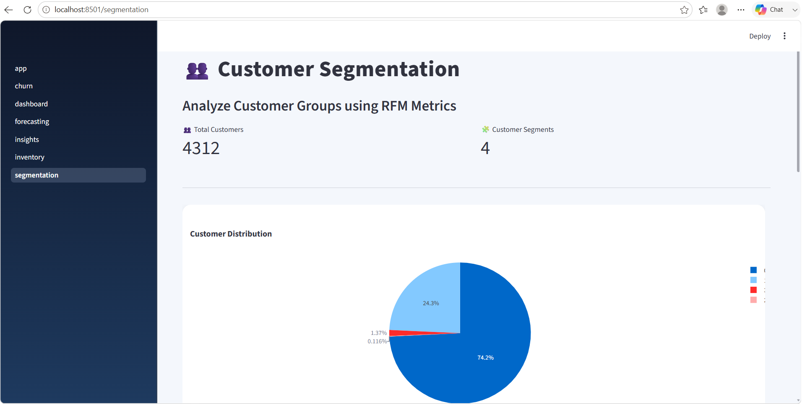
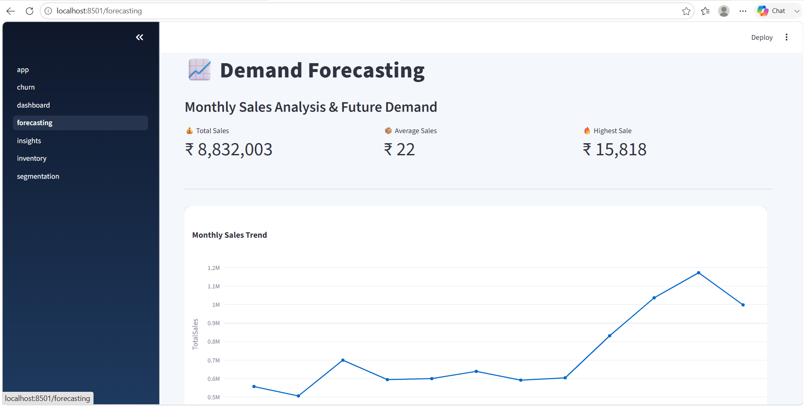
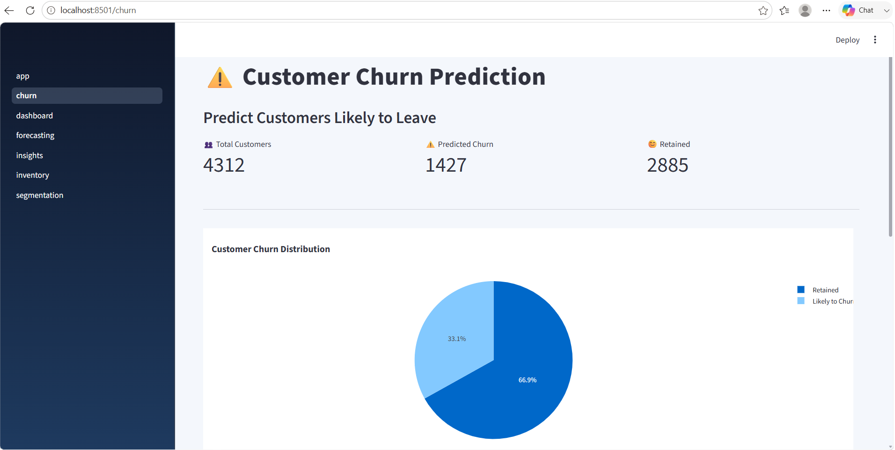
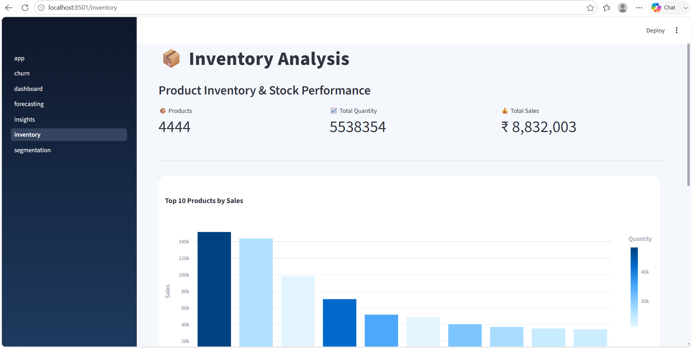
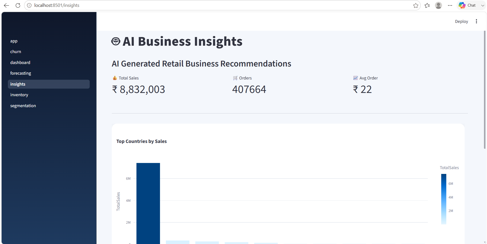

# 🛍️ NeuralRetail AI

AI-Powered Retail Business Intelligence Dashboard built using Python, Streamlit, Machine Learning, and Plotly.

---

## 📌 Project Overview

NeuralRetail AI helps retail businesses make smarter decisions by analyzing sales data, customer behavior, inventory, and future demand using Artificial Intelligence and Machine Learning.

---

## 🚀 Features

- 📊 Executive Dashboard
- 👥 Customer Segmentation
- 📈 Demand Forecasting
- ⚠️ Customer Churn Prediction
- 📦 Inventory Analysis
- 🤖 AI Business Insights
- 📉 Interactive Charts & Graphs
- 🎨 Modern Streamlit UI

---

## 🛠️ Tech Stack

- Python
- Streamlit
- Pandas
- Plotly
- Scikit-Learn
- Machine Learning
- Git & GitHub

---

## 📂 Project Structure

```
NeuralRetail-AI/
│
├── app/
│   ├── pages/
│   ├── assets/
│   └── app.py
│
├── data/
├── models/
├── reports/
├── src/
├── notebooks/
├── requirements.txt
└── README.md
```

---

## 📸 Screenshots

### 🏠 Home Page



### 📊 Executive Dashboard



### 👥 Customer Segmentation


### 📈 Demand Forecasting


### ⚠️ Customer Churn Prediction


### 📦 Inventory Analysis


### 🤖 AI Insights


---

## ⚙️ Installation

```bash
git clone https://github.com/bhavanavandanam46-ops/NeuralRetail-AI.git

cd NeuralRetail-AI

pip install -r requirements.txt

streamlit run app/app.py
```

---

## 📈 Future Enhancements

- Real-time Sales Prediction
- Cloud Deployment
- Deep Learning Models
- AI Chat Assistant
- Sales Recommendation Engine

---

## 👩‍💻 Developer

**Bhavana Vandanam**

B.Tech CSE

2026

---

⭐ If you like this project, consider giving it a star on GitHub.